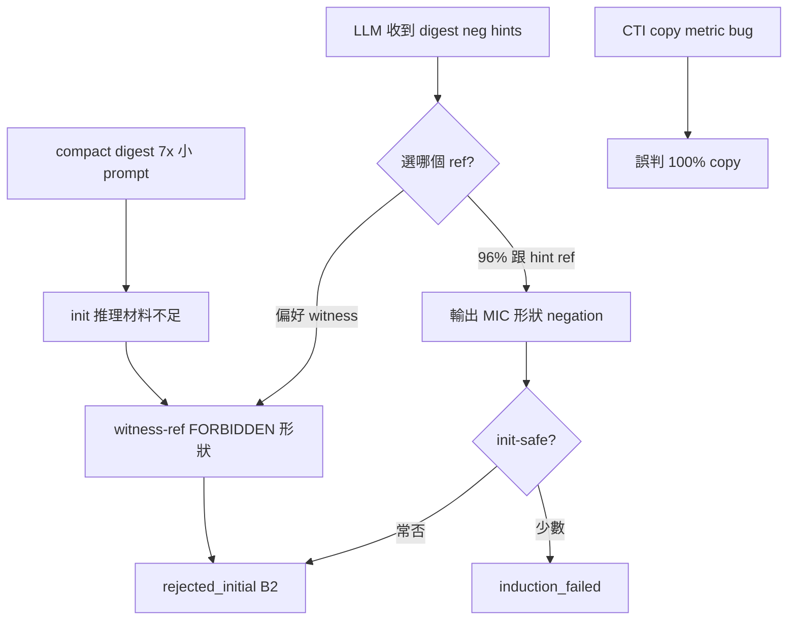

# Q3 Postmortem — 失敗根因與修訂計劃

**日期：** 2026-06-10  
**前置：** Q3.1+Q3.2 實作、`9ef248a`（digest/witness 矛盾修復 + always digest）  
**資料來源：**

| Run | OUT_BASE | 輪數 | B0 accept/API | B3 accept/API |
|-----|----------|------|---------------|---------------|
| 修復前 | `/tmp/q3_ab_multiround_20260610_015742` | 5 | 3.7% | 0.0% |
| 修復後 | `/tmp/q3_ab_multiround_20260610_022602` | 3 | 3.2% | 0.0% |

---

## 1. 執行摘要

Q3.1+Q3.2 **基礎設施修復已生效**（digest 覆蓋、prompt 矛盾消除），但 **accept/API 未提升、B2 仍 100%**。

真正卡點不是「模型沒讀 digest hints」，而是：

1. **模型持續輸出 witness-ref 的 FORBIDDEN 形狀**（27/27 RI 中 26 次命中）
2. **digest 否定 ≠ init-safe**（MIC 命中仍 RI）
3. **`CTI copy 100%` 是量測 bug**（compact digest 模式下幾乎全為 false positive）
4. **always-digest 使 prompt 縮小 7×**（56KB→8KB），可能促成少量 `induction_fail`（init 過了、inductive 失敗）

**策略轉向：** 從「更多 prompt 文字」→ **機械剔除 witness-ref + 修正量測 + 恢復多 clause 退路**。

---

## 2. 已確認有效的修復（保留）

| 修復 | 修復前 | 修復後 | 狀態 |
|------|--------|--------|------|
| `cti_digest` 每 request | ~9% 有 stats | **100%**（11/11） | ✅ |
| digest vs FORBIDDEN 矛盾 | retry 同時建議 `!witness` | 已過濾 witness-safe picks | ✅ |
| B3 MIC top-1 shape | 0–31% | **33.8%**（3 輪均值） | ✅ |
| 模型跟 hint ref | — | **85/89** disjunct ref 落在 hint 建議集 | ✅ |

---

## 3. 問題重新診斷

### 3.1 `CTI copy 100%` — 量測假警報 🔴

`diagnose_q2_smoke.disjunct_matches_cti_literal` 在 compact digest 模式下：

- `cti_entries` **無** `cube.literals`（僅 `literals: ["state24=1", ...]`）
- cube 迴圈走不完 → fallback `return True`（只要 ref 在 digest 即算 copy）

**重算（B3 r1，手動分類）：**

| 類別 | disjunct 數 |
|------|-------------|
| digest MIC 否定形狀 | 10 |
| 真正抄襲正向 CTI 字面 | **0** |
| 其他（多 clause、非 top-1 neg） | 21 |

→ **Gate 條件 `CTI copy ≤50%` 目前不可信**；須先修 metric 再驗收。

### 3.2 B2 仍 100% — 主因是 witness-ref FORBIDDEN 違規 🔴

B3 27 次 `rejected_initial` 機制分類：

| 失敗類型 | 次數 |
|----------|------|
| witness-ref + **FORBIDDEN 模板命中** | **26** |
| └ init_wide（bitmask witness） | 12 |
| └ init0 | 8 |
| └ init1 | 6 |
| witness-ref 其他形狀 | 1 |
| 非 witness-ref MIC 仍 RI | 0 |

**典型失敗（修復後仍發生）：**

```
witness: state798 -> #b000000000000  (init_wide)
digest top-1: state512=#b1
model output: !state798=#b000000000000   ← witness-ref 否定，FORBIDDEN
```

```
witness: state512 -> #b1  (init1)
digest top-1: state512=#b1  (已從 hints 過濾，但模型仍選 witness ref)
model output: !state512=#b1   ← FORBIDDEN
```

**結論：** Q3.1 FORBIDDEN **有注入**（35/35 retry prompts），但 **LLM 仍偏好 witness-ref 單字否定**；prompt-only 已觸天花板。

### 3.3 digest 否定有效但非充分 🟠

| 指標 | B0 | B3 |
|------|----|----|
| MIC top-1 命中 | 0% | 33.8% |
| hint ref 跟隨率 | — | 96% |
| RI 仍 100% B2 | ✓ | ✓ |

模型**確實**在跟 digest 否定策略，但：

- top-1 digest ref 常與 witness **無 init 關聯**（neg `state512` 擋不住 `state798` init）
- 當 top-1 == witness ref，模型仍輸出 witness-ref（即使 hints 已過濾該建議）
- **init_wide**（48% RI）超出 Q3.1 規則覆蓋——應 **禁止 block 含 witness ref 任何 disjunct**

### 3.4 `induction_fail` 3 次 — 微小正向信號 🟡

B3 r2 出現 3 次 `induction_failed`（B0 為 0）：

```
witness: state21 -> #b1
failed:  state21=#b0 polarity=true   (通過 init? 但 inductive 失敗)
```

解讀：prompt 縮小 + digest 否定使部分 block **離開 pure RI**，但未產出可 inductive 的 lemma。需 **分開** correctness vs inductiveness retry 模板（現有 feedback 分區已有，可再加硬規則）。

### 3.5 always-digest 副作用 🟡

| | 修復前 | 修復後 |
|--|--------|--------|
| mean user_prompt_bytes | ~56KB | **~8KB** |
| cti_entries 格式 | 完整 cube JSON | 僅 `literals[]` |
| B3 response clause 數 | 多為 1 | **3 clauses 佔 85%** |

影響：

- Init 語意推理材料變少（無 per-cube 結構）
- `sample_id=2` 鼓勵 3 個 digest-neg clause，但 verifier **只取第一個 valid** → 若 clause[0] 踩 FORBIDDEN，後備 clause 無用
- B0 僅 2 次 accept 來自 **非 top-1 ref 的多 clause**（如 `state281`、`state520`）

### 3.6 樣本數 🟡

3 輪 × ~11 req ≈ 33 API/arm；accept 0–1 次 → Δ 在 noise 內。結構性問題（26/27 FORBIDDEN viol）比 accept 數字更可信。

---

## 4. 根因因果鏈



---

## 5. 修訂計劃（Q3.5 起）

### 原則

1. **先修量測**，再談 gate
2. **prompt + 機械 guard** 雙軌；不再純 prompt
3. **保留 Q3.2 digest neg** 作 clause[0] 預設，**恢復多 clause 退路**
4. p040 驗收仍用 **5 輪加總**

### Phase Q3.5 — 量測修正（0.5 天）

| ID | 內容 | 檔案 |
|----|------|------|
| M1 | `true_pos_cti_copy_pct`：僅 polarity=true 且與 digest/cube 正向字面一致 | `diagnose_q2_smoke.py` |
| M2 | `digest_neg_pct` / `witness_forbidden_viol_pct` 分開報告 | 同上 |
| M3 | `init_safe_hint_pct`：hint 建議且未 hit FORBIDDEN | 同上 |

**新 gate 指標（取代 CTI copy）：**

- `witness_forbidden_viol_pct` **≤ 20%**
- `true_pos_cti_copy_pct` **≤ 10%**
- accept/API **≥ B0 + 5pp**（5 輪）

### Phase Q3.6 — Witness-ref 機械防護（1 天）⭐ 最高優先

| ID | 內容 | 檔案 |
|----|------|------|
| G1 | **Retry 禁止 witness ref**：`format_digest_block_hints` / `sample_hint` 明確寫「block must NOT mention witness ref」 | `prompt_format.py`, `ic3_frame_v1.txt` |
| G2 | **init_wide 規則**：witness 為寬位 `#b...` 時，FORBIDDEN = 該 ref **任何** disjunct | `prompt_format.py` |
| G3 | **Sidecar post-filter**（Track B-lite）：normalize 後若 disjunct hit `forbidden_disjuncts_for_witness` 或 `ref==witness.ref` on retry → 剔除；若 clause 空則替換為 safe digest neg | `sidecar.py` |
| G4 | 測試：post-filter 後 response 不含 witness-ref forbidden | `test_sidecar_batch.py`, `test_prompt_format_q3.py` |

### Phase Q3.7 — 多 clause 退路 + negative stats（1 天）

| ID | 內容 | 檔案 |
|----|------|------|
| P1 | `sample_id=0`：**clause[0]** safe digest neg；**clause[1]** 來自 `frame clause_digest` 中非 witness ref | `prompt_format.py` |
| P2 | 強化 `_negative_stats_from_feedback`：解析完整 `rejected_json` disjunct（含 `#b...`），不只 `0|1` regex | `prompt_format.py` |
| P3 | `format_frame_clause_digest` attempt≥2 必出 `AVOID` 列表（Q3.4 原計劃） | 已有骨架，補測試 |
| P4 | `sample_id=2` 改回「最多 2 clause」而非 3，減 token | `prompt_format.py` |

### Phase Q3.8 — C++ payload 平衡（1 天）

| ID | 內容 | 檔案 |
|----|------|------|
| C1 | digest 模式下 `cti_entries` 仍附 **首 cube 的 3–5 個 literal**（init 語意錨點） | `llm_generalizer.cpp` |
| C2 | `proof_context` 加 `witness_init_hint`（若 feedback 含 RI） | C++ + `format_proof_context` |
| C3 | 確保 shrink 後 digest 仍保留 `literal_stats` top-N | 已有，加回歸測試 |

### Phase Q3.9 — 驗收矩陣（5 輪 p040）

| 組別 | 內容 |
|------|------|
| B0 | `post-q2-clause-quality` tag |
| B3′ | HEAD（Q3.1+Q3.2 + `9ef248a`） |
| **B5** | B3′ + Q3.6 G1–G3（post-filter） |
| **B6** | B5 + Q3.7 P1–P4 |
| **B7** | B6 + Q3.8 C1–C2 |

```bash
MAX_ATTEMPTS=3 STRICT=0 ROUNDS=5 bash scripts/ab_q3_p040_multiround.sh
python3 scripts/diagnose_q2_smoke.py ...  # 用 M1–M3 新指標
```

**合入門檻（B6 vs B0，5 輪）：**

| 指標 | 目標 |
|------|------|
| accept/API | **≥ +5 pp** |
| `witness_forbidden_viol_pct` | **≤ 20%**（現 ~96%） |
| `rejected_initial` 總數 | **下降 ≥ 30%** |
| B2 占 RI | **≤ 70%** |

### Phase Q3.10 — 若 B6 未達 gate

| 條件 | 動作 |
|------|------|
| `witness_forbidden_viol` 仍 >50% | **Track B** `drop_literals` C++ 路徑（`frame_snapshot_quality_plan.md`） |
| `induction_fail` 上升、RI 降 | 分離 correctness / induction prompt 模板 |
| p040 accept <15% | 11 案子集 + tier 分報（Q3.5 原計劃） |

---

## 6. 不建議繼續的方向

| 方向 | 原因 |
|------|------|
| 再加長 FORBIDDEN 文字 | 已 100% 注入仍 96% 違規 |
| 僅調 sample 為單 clause digest neg | B0 accept 靠多 clause 非 top-1 |
| 用 `CTI copy` 作 gate | compact digest 下 metric 失真 |
| mbc=1 | Q2 已證實未勝出 |

---

## 7. 建議實作順序（本週）

```
Day 1:  Q3.5 M1–M3（量測） + Q3.6 G1–G2（prompt 強化）
Day 2:  Q3.6 G3（sidecar post-filter）+ 測試
Day 3:  Q3.7 P1–P4（多 clause + negative stats）
Day 4:  Q3.8 C1（C++ 首 cube 錨點）— 可選，視 G3 效果
Day 5:  Q3.9 五輪 p040 B0 vs B5/B6
```

**最小可驗證增量（MVP）：** 僅 **G3 post-filter** + **M1 量測修正** → 3 輪 smoke，預期 `witness_forbidden_viol` 從 96% → <30%。

## Agent 須知

1. **Commit 後自動 push** — 每次 commit 後 **直接 `git push origin main`**，不需詢問使用者。
2. **Smoke 驗收** — Q3.x 實作 + unit test 通過後，**直接跑 5 輪 p040 smoke**（`ROUNDS=5`），不需詢問。回報 aggregate 與 Q3.5 新指標。

---

## 8. 相關文件

- [`clause_quality_q3_plan.md`](clause_quality_q3_plan.md) — 總路線圖（待更新狀態）
- [`clause_quality_q3_1_q3_2_plan.md`](clause_quality_q3_1_q3_2_plan.md) — Q3.1/Q3.2 詳規
- [`frame_snapshot_quality_plan.md`](frame_snapshot_quality_plan.md) — Track B 完整方案
- Smoke：`scripts/ab_q3_p040_multiround.sh`
