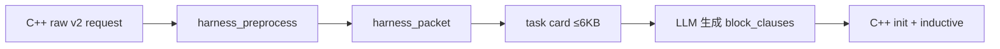

# Phase Q4 — Harness 重設計（精簡 task card + init 預處理）

**狀態：** ✅ 完成（Q4.0–Q4.6 已實作；待 5-round smoke 驗收數據）  
**日期：** 2026-06-10  
**前置：** Q3 postmortem（[`clause_quality_q3_postmortem_plan.md`](clause_quality_q3_postmortem_plan.md)）、D3b init 語意診斷

---

## 策略轉向（一句話）

**停止堆 prompt 補丁（Q2/Q3）；改為 C++ 匯出 init 事實 → preprocessor 壓成 ≤6KB task card → LLM 仍生成 block → C++ 驗證。**

Q3 證明：模型會跟 digest hints（~95% digest neg），但 **init 資訊缺口** 導致 RI 仍 ~100%。問題在 harness，不在「再教它怎麼想 init」。

---

## 已完成（2026-06-10）

| 項目 | 狀態 | 檔案 |
|------|------|------|
| API `response_format=json_object` **永久開啟** | ✅ | `llm_worker/llm_client.py` |
| 移除 `LLM_JSON_MODE` 切換 | ✅ | `llm_worker/env_config.py` |
| 精簡 `extract_json()`（僅剝 fence） | ✅ | `llm_worker/llm_client.py` |
| 精簡 sidecar footer / system prompt JSON 散文 | ✅ | `sidecar.py`, `prompts/ic3_frame_v1.txt` |
| `max_tokens` 4096（block JSON 足夠） | ✅ | `llm_client.py` |
| 測試 | ✅ 98 passed | `tests/test_llm_client_json_mode.py` |
| **Q4.1 task card**（ordered harness） | ✅ | `harness_preprocess.py`, `sidecar.py` |
| Self-check → MUST_FALSIFY → INIT_TABLE 置頂 | ✅ | 越重要、越不變的放越前 |
| `self_check` response 欄位 | ✅ | `ic3_frame_schema.py` |
| 測試 | ✅ | `tests/test_harness_preprocess.py` |

---

## Task card 區塊順序（已實作）

| 順序 | 區塊 | 穩定度 | 作用 |
|------|------|--------|------|
| 1 | **Self-check checklist** | 固定 | LLM 輸出前自覺三步 |
| 2 | **MUST_FALSIFY** | 每 batch | bad path：不可抄正向 CTI 字面 |
| 3 | **INIT_TABLE** | 每 batch + witness/`init_raw` | reset vs CTI；`init_raw.values` 已由 C++ 匯出 |
| 4 | **Micro-example** | 衍生 top-1 | 本輪 BAD/OK 各一 |
| 5 | **CANDIDATES** | 軟建議 | digest neg，非強制 |
| 6 | **REPAIR** | retry only | 對比式 you_tried / init_witness |
| 7 | **CTI summary** | 壓縮 | top-10 stats + ≤2 sample cubes |
| 8 | **Frame hints** | 壓縮 | top-5 clause stats |
| 9 | **task + json** | 固定模板 | `self_check` + `block_clauses` |

**原則：** 全部靠 LLM 生成；harness 不代寫 block。C++ 仍只驗 init + rel_ind。

---

## 目標架構

```text
Stage 1  C++ capture     buffer CTIs + init_raw + structured feedback
Stage 2  Preprocessor    raw JSONL → harness_packet v1（裁切 + init 標註）
Stage 3  Sidecar（薄）    render_task_card → API(json_object) → normalize
Stage 4  C++ verify      rel_ind_check → accept / feedback → retry
```



### 分工原則

| 誰 | 做什麼 |
|----|--------|
| **C++** | init 值、witness、digest stats、init_safe 預算（SAT 已有） |
| **Preprocessor** | 合併、裁切、constraints、repair 結構化 |
| **LLM** | 在 init-safe 空間內**選/組** disjunct（仍寫 JSON） |
| **Sidecar** | 渲染 + schema validate（不代寫 block） |

---

## harness_packet schema（v1）

Preprocessor 輸出（不直接送 API，先經 `render_task_card`）：

```json
{
  "type": "harness_packet",
  "schema_version": 1,
  "task": {
    "batch_id": "batch_f3_a1",
    "frame_idx": 3,
    "attempt": 1,
    "max_block_clauses": 3,
    "sample_id": 0
  },
  "proof": {
    "cti_total": 96,
    "clauses_total": 52,
    "feedback_count": 0
  },
  "init_table": [
    {"ref": "state512", "init": "#b1", "cti_top": "#b1", "same": true},
    {"ref": "state798", "init": "#b000...", "cti_top": null, "same": null}
  ],
  "candidates": [
    {"rank": 1, "lit": "state34=#b1", "count": 96, "block": "!state34=1", "init_safe": true},
    {"rank": 2, "lit": "state561=#b0000", "count": 96, "block": "!state561=#b0000", "init_safe": false, "reason": "init_true"}
  ],
  "constraints": {
    "must_falsify": ["state34=#b1", "state561=#b0000"],
    "forbidden_refs": ["state512"],
    "forbidden_disjuncts": ["!state512=1", "state512=0"]
  },
  "repair": null,
  "frame_hints": {
    "top_lits": ["state19=#b0(20)"]
  }
}
```

### Preprocessor 演算法

```text
1. COLLECT_REFS     digest_top(10) ∪ witness_refs ∪ failed_clause_refs
2. BUILD_INIT_TABLE C++ init_raw.values + cti mode per ref
3. BUILD_CANDIDATES MIC_negate(digest simple lits); rank init_safe first
4. BUILD_CONSTRAINTS cumulative witness forbidden; must_falsify = digest top-5
5. BUILD_REPAIR     attempt≥2 only; structured from feedback_raw
6. TRIM_TO_BUDGET   init_table≤15, candidates≤8, drop sample cubes from API path
7. EMIT harness_packet
```

### Task card 模板（user prompt ≤6KB）

```text
batch_id=... frame=3 attempt=2 sample_id=0
proof: cti_total=96 clauses_total=52 feedback=1

INIT (reset; CTI≠init):
  state512  init=#b1  cti_top=#b1  SAME
  state798  init=#b000...  cti_top=—

CANDIDATES (suggestions; prefer init_safe=true):
  #1 state34=#b1 → !state34=1  [init_safe]
  #2 state561=#b0000 → !state561=#b0000  [UNSAFE]

CONSTRAINTS:
  must_falsify: state34=#b1 | ...
  forbidden_refs: state512

REPAIR (if attempt≥2):
  last_fail=rejected_initial witness=state512=#b1 failed=!state512=1

FRAME: top state19=#b0(20)

Output json: 1..3 block_clauses. source_cti_id=... sample_id=0
```

**關鍵：** `candidates` 是**建議**不是唯一答案；保留 2–3 clause 退路（不同 init_safe ref）。

---

## INIT_TABLE `init=?` 缺口（Q4.2 必補）

### 現象

Q4.1 task card 已輸出 **INIT_TABLE**，但 **attempt 1** 常見：

```text
  ref          init           cti_top
  state34      ?              state34=#b1
  state512     ?              state512=#b1
```

`?` 表示 harness **不知道該 ref 在 reset 的值**；`cti_top` 仍來自 digest（bad path 統計）。

### 根因（資訊缺口，非表格式 bug）

`harness_preprocess.build_init_table()` 的 `init` 來源優先序：

| 來源 | attempt 1 | attempt 2+ |
|------|-----------|------------|
| `req.init_raw.values`（C++） | ✅ `build_init_raw_json_for_llm` | ✅ `build_init_table` |
| `feedback.witness`（RI 後） | ❌ 無 feedback | ✅ 僅 witness 那一 ref |
| digest top refs | ✅ 只填 `cti_top` | ✅ |

C++ **已會算 init**（`check_intersects_initial_with_witness` + `init_label_`），但算完只用來 **拒絕**，沒有在 **第一次 request** 就 export 給 LLM。

### 為何 MUST_FALSIFY 不夠

| 表 | 解決 | attempt 1 狀態 |
|----|------|----------------|
| **MUST_FALSIFY** | 不可 **抄** CTI 正向字面（bad path） | ✅ 已有 |
| **INIT_TABLE init 欄** | 不可讓 OR-clause 在 **reset** 為真 | ❌ 多為 `?` |

典型失敗（D3b **B2**，約 64.6% RI）：

```text
digest/CTI: state512=#b1
LLM 輸出:   !state512=1     （以為在 falsify CTI）
init 其實:  state512=#b1   → 否定後在 init 仍為真 → rejected_initial
```

Q3 五輪：digest neg **形狀 ~95%**，accept **0%** — 與「有 CTI、無 init 表」一致。

### witness 為何只能補一部分（不能取代 init_raw）

Retry 時 `feedback.witness` 會把 **該 ref** 的 init 填入 INIT_TABLE，並觸發 REPAIR 區塊。

限制：

| 限制 | 說明 |
|------|------|
| **事後** | attempt 1 已浪費一次 API + RI |
| **單點** | 一輪通常一個 witness ref，不是整張 init 快照 |
| **覆蓋不全** | digest 裡其他 ref 仍為 `?` |
| **init_wide** | 寬位 witness（`#b000...`）難推出應選哪個 disjunct |

witness = **失敗後局部補丁**；**init_raw** = **事前完整表**（針對 digest top-N refs）。

### Q4.2 要補什麼（C++ → request JSON）

在 `serialize_batch_request` 附加（attempt 1 起就有）：

```json
"init_raw": {
  "refs": ["state34", "state512", "state798"],
  "values": {
    "state34": "#b0",
    "state512": "#b1",
    "state798": "#b000000000000"
  }
}
```

- **refs 範圍：** digest top-N（如 10–15）∪ 累積 witness refs；不必 export 全設計。
- **values 算法：** 對每 ref 在 `init_label_` 約束下 get-value（與 witness 提取同 solver 上下文）。
- **harness 行為：** `init_raw.values[ref]` → INIT_TABLE `init` 欄；可標 `SAME` 當 init 與 cti_top 一致。

補完後 attempt 1 範例：

```text
  state512     #b1            state512=#b1    SAME   ← LLM 應避開 !state512=1 類形狀
  state34      #b0            state34=#b1          ← negate 有機會同時 falsify CTI（仍須 rel_ind）
```

**分工不變：** 仍 100% LLM 生成 block；harness 只補 **事實表**，C++ verifier 仍只做 init + rel_ind。

### 驗收（Q4.2）

| 指標 | 目標 |
|------|------|
| attempt 1 request 含 `init_raw.values` | 100% batch flush |
| INIT_TABLE `init=?` 列數 / 總列數 | **≤ 20%**（僅未知 ref） |
| `rejected_initial`（B2 類） | 較 Q4.1 降 ≥ 30% |

實作檔：`engines/ic3base.cpp`（查 init 值）、`engines/llm_generalizer.cpp`（序列化進 JSONL）。

---

## C++ raw request 增量（v2）

在現有 `ic3_frame_batch_request` 上加欄位（不破壞 v1 讀取）：

| 欄位 | 來源 |
|------|------|
| `init_raw.refs[]` | digest top-N + witness + failed refs |
| `init_raw.values{}` | `init_label_` + get-value per ref |
| `candidate_hints[]` | 可選：C++ 預算 `{lit, block_disjunct, init_safe}` |
| `feedback_raw[]` | 結構化取代僅 `rejected_json` 字串 |

實作檔：`engines/llm_generalizer.cpp`, `engines/ic3base.cpp`

---

## 退役（Q2/Q3 prompt 堆疊）

| 退役 | 取代 |
|------|------|
| `format_digest_block_hints` 散文 | `candidates` 表 |
| `format_init_aware_block` | `init_table` |
| `format_witness_repair` FORBIDDEN 模板 | `constraints` + `repair` |
| `sample_generalization_hint` 三策略 | candidates rank + max_block_clauses |
| Q3.6 `apply_witness_forbidden_post_filter` 代寫 | 不應再需要（0/55 觸發） |
| 8 sample cubes + 12 frame clauses 全文 | stats only |

System prompt v2：schema + 讀表規則 + 2 個例子（目標 ~2KB）。

---

## 實作分期

| Phase | 內容 | 工時 | 檔案 |
|-------|------|------|------|
| **Q4.0** | JSON mode 永久開啟 | ✅ | `llm_client.py`, `sidecar.py` |
| **Q4.1** | `harness_preprocess.py` + `render_task_card()` + sidecar 切換 | ✅ | `harness_preprocess.py`, `sidecar.py` |
| **Q4.2** | C++ `init_raw.values` + `feedback_raw[]` | ✅ | `ic3base.cpp`, `llm_generalizer.cpp` |
| **Q4.3** | C++ `candidate_hints.init_safe` 預算 | ✅ | `ic3base.cpp` |
| **Q4.4** | sidecar `--harness-legacy` A/B 路徑 | ✅ | `sidecar.py`, `prompt_format.py` |
| **Q4.5** | system prompt v2（~2KB） | ✅ | `prompts/ic3_frame_v1.txt` |
| **Q4.6** | `inspect_harness_packet.py` + `ab_q4_p040_multiround.sh` | ✅ | `scripts/` |

---

## 驗收（5 輪 p040，B8 vs B0）

```bash
MAX_ATTEMPTS=3 STRICT=0 ROUNDS=5 bash scripts/ab_q4_p040_multiround.sh  # 待建
```

| 指標 | 目標 |
|------|------|
| `user_prompt_bytes` mean | **≤ 6 KB** |
| `init_table_coverage_pct` | ≥ 90% |
| `witness_forbidden_viol_pct` | ≤ 20%（現 ~100%） |
| `rejected_initial` 總數 | ↓ ≥ 30% |
| accept/API | **≥ B0**（~8%） |

### 品質預期（誠實）

- **高信心改善：** B2 init 猜錯（D3b 64.6% RI）
- **不自動解：** `induction_failed`（需後續 Track B / MIC drop_literals）
- **風險：** candidates 設太死 → init 過、inductive 全死；故 **soft candidates + 多 clause**

---

## 與其他計劃關係

| 計劃 | 關係 |
|------|------|
| [`frame_snapshot_quality_plan.md`](frame_snapshot_quality_plan.md) Track B | Q4 後若 accept 仍低，接 `drop_literals` + C++ MIC |
| [`clause_quality_q3_plan.md`](clause_quality_q3_plan.md) | **凍結**新 prompt 項；保留 always-digest、metrics |
| [`lemma_expressiveness_roadmap.md`](lemma_expressiveness_roadmap.md) | Gate 0 仍待 Q4 數據 |

---

## Agent 須知

1. Q4.1 起：改 harness 後跑 5-round smoke（同 Q3 規則）。
2. 文件同步：本檔 + `ic3_frame_v1_integration.md` API 小節 + `HANDOFF_CURRENT_STATE.md`。
3. 不要恢復 `LLM_JSON_MODE` 或 prompt-only init 補丁。
