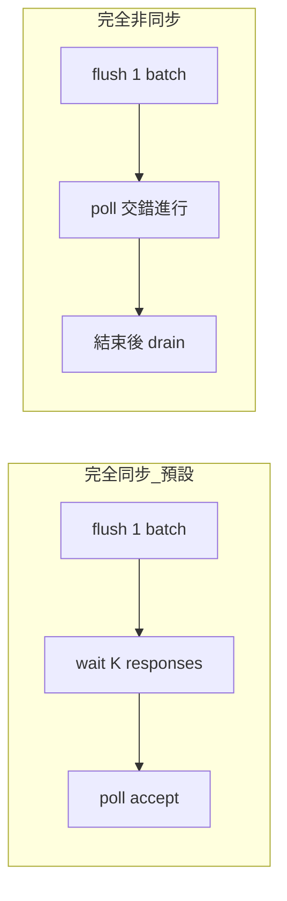
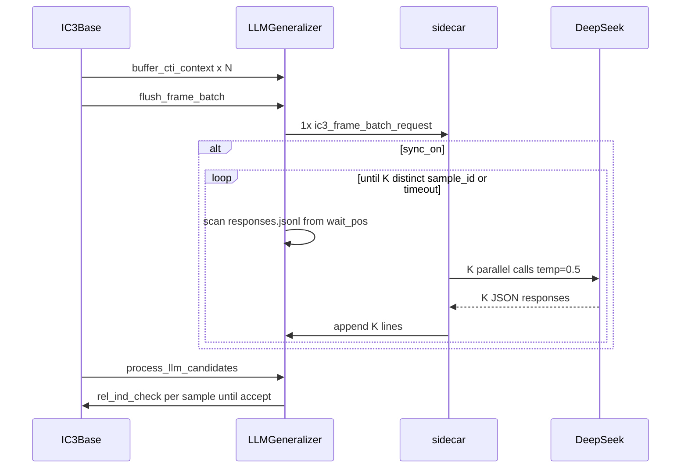

# Batch 全 CTI 單結論 + Flush 後同步等待

**狀態：** 已實作（2026-06-04）  
**前置：** IC3 Frame v1、thinking disabled、smoke session 隔離（commits ahead 3，未 push）  
**關聯：** [p040-smoke-session-latency-plan.md](p040-smoke-session-latency-plan.md)

---

## 產品語意

```text
block_all 期間累積 CTI_1 … CTI_N
        ↓  （一次給模型「本輪 blocking 全貌」）
   LLM 通讀、綜合（不必對每 CTI 各寫答案）
        ↓
   一個結論 = 一條 general block（+ 短 rationale）
        ↓
   C++：一次 initial + 一次 rel_ind_check → constrain_frame
```

| 要 | 不要 |
|----|------|
| 本輪 flush 的 **全部** CTI 進同一 request | N 次 API（現況 ~52 CTI → ~52 request） |
| **K=3** 同一 prompt 的 3 個 sample（temp=0.5） | 1 次回傳 52 組 `block_disjuncts` |
| flush 後 **同步等待** K 個 response（方案 A） | 只靠 pono 結束後 drain、stats 失真 |
| 僅 **兩種** 執行模式（見下） | 四種 CLI 組合、per-CTI 52×API 作為正式路徑 |

---

## 執行模式（2026-06 決策：只留兩種）

| 模式 | CLI | batch request | flush 後 | 用途 |
|------|-----|---------------|----------|------|
| **完全同步（主力，預設）** | （預設） | 1 行 / 輪 blocking | `wait_for_batch_responses` → 再 `poll` | 實驗可重現、`accepted` / `candidates` 可信 |
| **完全非同步** | `--no-llm-sync-after-flush` | 同上 1 行 / 輪 | **不** wait；靠 poll + smoke/benchmark **drain** | 低延遲插入 proof loop；stats 易失真，**尚未修完**（見審查 P0/P1） |

**不再作為正式支援的「舊行為」**（可保留程式分支僅供除錯，不寫進 smoke/benchmark）：

| 舊行為 | 說明 | 是否保留 |
|--------|------|----------|
| **per-CTI async**（`--no-llm-batch-cti`） | 每 CTI 一行 `ic3_frame_request`，~52×K API/輪；flush 後不 wait | **不必保留**為產品模式；與 batch 目標重複且成本高 |
| sidecar `temperature=0.8` 寫死 | 單 CTI 時代預設 | batch 用 **0.5**；若刪 per-CTI 則無需恢復 0.8 |
| 只靠 pono 結束後 drain | 無 `wait` 時 response 晚到 → `accepted≈0` | 非同步模式仍用 **drain**；同步模式 **不依賴** drain 救 stats |



**實作收斂建議：**

- 預設維持 `llm_batch_cti_=true`、`llm_sync_after_flush_=true`。
- 文件與 smoke 只描述上述兩種；`--no-llm-batch-cti` 標為 deprecated / debug-only（可後續刪除 for-loop）。
- 非同步模式修完審查 **P0**（batch retry `lookup_batch_meta`）後才算「可選模式」達標。

---

## 現況（程式庫快照）

| 元件 | 現況 |
|------|------|
| [`flush_frame_batch`](engines/llm_generalizer.cpp) | for-loop → N 行 `ic3_frame_request` |
| [`ic3base.cpp` step](engines/ic3base.cpp) L482–489 | flush → `process_llm_candidates`（無 wait） |
| [`block_all`](engines/ic3base.cpp) L689–694 | 每 50 inner iters `process_llm_candidates`（僅舊 response） |
| [`sidecar.py`](llm_worker/sidecar.py) | `temperature=0.8`；`validate_request` 僅 single-CTI |
| [`run_benchmarks.py`](scripts/run_benchmarks.py) `_run_one_llm` | 無 drain、無 `max_inflight`、無 `reasoning_effort` |
| Smoke `L2pXka` | drain 後 `requests=136` / `accepted=1` |

---

## 協議

### Request：`ic3_frame_batch_request`

```json
{
  "schema_version": 1,
  "type": "ic3_frame_batch_request",
  "batch_id": "batch_f2_a1",
  "frame_idx": 2,
  "attempt": 1,
  "max_attempts": 2,
  "parallel_group": "batch_f2_a1",
  "parallel_samples": 3,
  "temperature": 0.5,
  "reasoning_effort": "none",
  "model": "deepseek-v4-pro",
  "benchmark_context_path": "/path/benchmark_context.json",
  "cti_entries": [
    { "cti_id": "f2_abc...", "cti": { "cube": { "literals": [...] } } }
  ],
  "frame_snapshot": { "frame_idx": 2, "clauses": [...] },
  "feedback": []
}
```

- `batch_id` = `"batch_f" + frame_idx + "_a" + attempt`
- 去重鍵：`sent_request_ids_` ← `batch_id + "#" + attempt`
- `feedback_by_cti_[batch_id]`（鍵名沿用 map，語意為 batch）

### Response：沿用 `ic3_frame_response`

- `source_cti_id` = **batch_id**
- 單一 `block_disjuncts`（≤8 disjuncts）
- K 行，`sample_id` 0..K-1；C++ parser 不變（[`ic3_frame_ast.cpp`](engines/ic3_frame_ast.cpp)）

### C++ 驗證語意

- 一次 `check_intersects_initial` + 一次 `rel_ind_check(frame_idx, …)`。
- Prompt 約束：block 須對 **全部** CTI cube 為 false；**不**在 C++ 逐 cube 檢查。
- `llm_accepted_budget`：每 batch 第一個通過 induction 的 sample 即 `break`（計 1 accept）。

---

## 資料流



---

## 逐檔實作規格

### A. `llm_worker/ic3_frame_schema.py`

```python
def validate_batch_request(req: Dict) -> Tuple[bool, str]:
    if req.get("type") != "ic3_frame_batch_request":
        return False, "type must be ic3_frame_batch_request"
    for key in ("batch_id", "frame_idx", "cti_entries"):
        if key not in req:
            return False, f"missing {key}"
    entries = req.get("cti_entries") or []
    if not entries:
        return False, "cti_entries empty"
    for i, ent in enumerate(entries):
        if not ent.get("cti_id") or "cti" not in ent:
            return False, f"cti_entries[{i}] invalid"
    return True, ""

def validate_request(req: Dict) -> Tuple[bool, str]:
    t = req.get("type")
    if t == "ic3_frame_batch_request":
        return validate_batch_request(req)
    if t == "ic3_frame_request":
        ...  # 現有邏輯
    return False, f"unknown type: {t}"
```

### B. `llm_worker/prompt_format.py`

```python
def format_cti_batch_all(entries: list[dict]) -> str:
    lines = [f"All CTI cubes this blocking round (cti_total={len(entries)}):"]
    for ent in entries:
        cid = ent.get("cti_id", "?")
        lit_line = format_cti_literals(ent.get("cti") or {})
        # 去掉單 CTI header，只留 literal 行
        body = lit_line.split("\n", 1)[-1] if "\n" in lit_line else lit_line
        lines.append(f"[{cid}] {body.replace(chr(10), ' | ')}")
    return "\n".join(lines)
```

### C. `llm_worker/prompts/ic3_frame_v1.txt`（新增段落）

```text
## Batch mode (ic3_frame_batch_request)
- Input lists ALL CTI cubes from this blocking round (cti_total=N).
- Read every cube; you may ignore outlier CTIs mentally, but output ONE conclusion.
- Output exactly ONE block_disjuncts (one OR-clause, at most 8 disjuncts).
- The block must be false on EVERY listed CTI cube and must not hold on initial state.
- Set source_cti_id to batch_id from the request (not individual cti_id).
```

### D. `llm_worker/sidecar.py`

**分流：**

```python
def build_user_prompt(...):
    if req.get("type") == "ic3_frame_batch_request":
        return build_batch_user_prompt(...)
    ...  # 現有 single-CTI

def process_request(...):
    ok, err = validate_request(req)
    ...
    source_id = req.get("batch_id") or req.get("cti_id", "")
    parallel_samples = int(req.get("parallel_samples", 1))
    temperature = float(req.get("temperature", 0.5))
    ...
    client.call(..., temperature=temperature)
    normalized = normalize_response(raw, source_id, sample_id, attempt)
```

**`handle_one_request` log 欄位：**

```python
log_entry = {
    ...
    "batch_id": request.get("batch_id"),
    "cti_id": request.get("cti_id"),  # batch 時為 None
    "cti_total": len(request.get("cti_entries") or []),
    "request_type": request.get("type"),
}
```

**`process_request` 內 `build_user_prompt`：** batch 路徑傳 `req` 給 `build_batch_user_prompt`，`sample_id` 仍 per-sample。

### E. `options/options.{h,cpp}`

在 `LLM_RESPONSE_PATH` 後插入 enum（避免 renumber 風險：僅 **append** 新項到 usage 表前、`{0,0,0,0,0,0}` 前）：

| Index 名 | CLI | 效果 |
|----------|-----|------|
| `LLM_NO_BATCH_CTI` | `--no-llm-batch-cti` | `llm_batch_cti_ = false` |
| `LLM_NO_SYNC_AFTER_FLUSH` | `--no-llm-sync-after-flush` | `llm_sync_after_flush_ = false` |
| `LLM_BATCH_WAIT_SEC` | `--llm-batch-wait-sec N` | `llm_batch_wait_sec_ = stoul` |

`PonoOptions` 預設：`llm_batch_cti_=true`，`llm_sync_after_flush_=true`，`llm_batch_wait_sec_=120`。

公開 accessor（供 `ic3base`）：`bool llm_batch_cti() const` 等，或直接用成員（現有 style 用成員）。

### F. `engines/llm_generalizer.h`

新增成員／方法：

```cpp
struct BatchMeta { size_t frame_idx = 0; std::vector<StoredCTI> ctis; };

std::string last_flushed_batch_id() const;
bool lookup_batch_meta(const std::string& batch_id, size_t& out_frame) const;

void write_batch_request(size_t frame_idx,
                         const std::string& frame_snapshot_json,
                         const std::vector<BufferedCTI>& buffered);
bool wait_for_batch_responses(const std::string& batch_id,
                              size_t expected_samples,
                              unsigned timeout_sec);

std::unordered_map<std::string, BatchMeta> batch_store_;
std::string last_flushed_batch_id_;
size_t num_batch_timeout_ = 0;  // 併入 GeneralizationStats
```

### G. `engines/llm_generalizer.cpp`

**`append_cti_cube_json(ostream&, const CTIContext&)`** — 從 `serialize_frame_request` L293–307 抽出。

**`write_batch_request`：**

1. `attempt = feedback_attempt(batch_id)`；超過 `max_attempts` 則 return。
2. `req_id = batch_id + "#" + attempt`；已在 `sent_request_ids_` 則 return。
3. 組 `cti_entries` JSON array；寫入 `batch_store_[batch_id]`。
4. 一行 JSONL append；`register_outstanding_samples(batch_id, attempt)`；`stats_.num_requests++`（**+1**）。
5. `last_flushed_batch_id_ = batch_id`；`attempt_by_cti_[batch_id]` 若無則設 1。

**`flush_frame_batch`：**

```cpp
if (!opts_.llm_batch_cti_) {
  for (const auto& buffered : it->second)
    write_request_for_cti(buffered.ctx, frame_snapshot_json);
} else {
  write_batch_request(frame_idx, frame_snapshot_json, it->second);
}
frame_cti_buffer_.erase(it);
```

**`wait_for_batch_responses` 演算法：**

```cpp
bool LLMGeneralizer::wait_for_batch_responses(
    const string& batch_id, size_t expected, unsigned timeout_sec) {
  using clock = chrono::steady_clock;
  auto deadline = clock::now() + chrono::seconds(timeout_sec);
  const auto wait_pos = last_response_pos_;  // 不消費；poll 仍從此讀

  while (clock::now() < deadline) {
    unordered_set<size_t> samples;
    ifstream fin(response_path_);
    if (fin) {
      fin.seekg(wait_pos);
      string line;
      while (getline(fin, line)) {
        if (line.find(batch_id) == string::npos) continue;
        auto resp = parse_ic3_frame_response_line(line);
        if (resp.valid && resp.source_cti_id == batch_id)
          samples.insert(resp.sample_id);
      }
    }
    if (samples.size() >= expected) return true;
    this_thread::sleep_for(chrono::milliseconds(200));
  }
  stats_.num_batch_timeout++;
  return false;
}
```

注意：`wait` **不**更新 `last_response_pos_`；`poll_responses` 負責消費。

**P0 修復（2026-06-05）：**

1. **真正根因**：[`ic3_frame_ast.cpp`](engines/ic3_frame_ast.cpp) `parse_string_field` 無法解析數字 `sample_id`，誤讀 `"attempt"` → 三筆 response 皆 `sample_id=0` → wait 永遠只數到 1/3 → timeout。修復：`parse_uint_field`。
2. **防禦性**：[`llm_generalizer.cpp`](engines/llm_generalizer.cpp) `poll`/`wait` streampos（`safe_response_offset`、`wait` 全檔掃描）。

**Retry：**

```cpp
void write_retry_request(const string& id, const string& snapshot) {
  if (id.rfind("batch_", 0) == 0) {
    auto it = batch_store_.find(id);
    if (it == batch_store_.end()) return;
    vector<BufferedCTI> buf;
    for (const auto& s : it->second.ctis) { BufferedCTI b; b.ctx = s.ctx; buf.push_back(b); }
    write_batch_request(it->second.frame_idx, snapshot, buf);
    return;
  }
  ...  // 現有 per-CTI
}
```

### H. `engines/ic3base.cpp`

**`step()` L482–489** — 見前文片段。

**`process_llm_candidates` L1804–1808：**

```cpp
size_t frame_idx = 0;
smt::TermVec cube;
if (cti_id.rfind("batch_", 0) == 0) {
  if (!llm_gen_->lookup_batch_meta(cti_id, frame_idx)) {
    llm_gen_->stats_.num_lookup_miss++;
    continue;
  }
} else if (!llm_gen_->lookup_cti_meta(cti_id, frame_idx, cube)) {
  ...
}
```

其餘 accept / feedback / `finish_attempt` / `mark_accepted` **鍵皆為 `cti_id` 變數**（batch 時即 batch_id）。

**`log_stats` / `LLM_STATS`：** 加 `batch_timeouts=`。

### I. `scripts/smoke_p040.sh`

| 變數 | 舊預設 | 新預設 |
|------|--------|--------|
| `PARALLEL_SAMPLES` | 1 | **3** |

pono 不需顯式傳 batch 旗標（預設 on）；A/B：`--no-llm-batch-cti`。

**結尾 Python 斷言（新增）：**

```python
req_lines = open(REQ).read().splitlines()
types = [json.loads(l).get("type") for l in req_lines if l.strip()]
assert all(t == "ic3_frame_batch_request" for t in types), types[:3]
# 粗估：requests 應遠小於 52*frames（例如 < 30 對 k=5 smoke）
assert len(req_lines) < 80, f"too many requests: {len(req_lines)}"
for line in open(LOG):
    e = json.loads(line)
    if e.get("request_type") == "ic3_frame_batch_request":
        assert e.get("cti_total", 0) >= 1
        break
```

### J. `scripts/run_benchmarks.py`

`_run_one_llm` 對齊 smoke：

```python
sidecar_proc = subprocess.Popen([
    sys.executable, sidecar_path,
    ...
    "--max-inflight-requests", str(job_data.get("llm_max_inflight", 8)),
    "--snapshot-max-clauses", str(job_data.get("snapshot_max_clauses", 50)),
], ...)
```

`run_pono` llm 模式追加：

```python
"--llm-reasoning-effort", "none",
"--llm-parallel-samples", str(job_data.get("llm_parallel_samples", 3)),
```

pono 結束後 **drain**（複製 smoke：`req_n` vs `log_n`），再 terminate sidecar。

### K. `docs/ic3_frame_v1_integration.md`

新增 §「Batch request v1」：欄位表、與 single-CTI 對照、sync wait 語意。

### L. 測試（`llm_worker/tests/`）

| 檔案 | 案例 |
|------|------|
| `test_batch_schema.py` | 合法 batch；缺 `cti_entries`；空 entries |
| `test_prompt_format.py` | `format_cti_batch_all` 含 `cti_total=2`、兩行 `[cti_id]` |
| `test_sidecar_batch.py`（可選） | mock client，`process_request` 回 3 行、`source_cti_id=batch_f1_a1` |

C++ 單元測試（若專案有 harness）：可後補 `wait` 用假 `responses.jsonl` 檔。

---

## 邊界案例

| 案例 | 行為 |
|------|------|
| buffer 空 | `flush_frame_batch` no-op；`last_flushed_batch_id_` 不清空上次值 → **flush 前** `last_flushed_batch_id_.clear()` |
| sync wait 逾時 | `num_batch_timeout++`；仍 `process_llm_candidates`（部分 K） |
| 重複 flush 同 attempt | `sent_request_ids_` 擋第二次 |
| `block_all` 內 poll | 僅處理**已存在** response；本輪 batch 在 flush+wait 後才 ingest |
| `--no-llm-sync-after-flush` | 行為退回 async；依賴 drain + `final_llm_poll` |
| `--no-llm-batch-cti` | 完整保留現 for-loop 路徑 |
| sidecar `max_requests` 上限 | benchmark 需調高或 batch 後 request 數大減 |

---

## 驗收標準

| 指標 | per-CTI（舊） | batch + sync（新） |
|------|---------------|-------------------|
| `requests.jsonl` 行數 | ~Σ CTI/frame | ~blocking 輪數（p040 smoke **< 80**） |
| API calls / flush | ~N×K | **1×K** |
| `llm_log` 行數 | ≈ requests | ≈ requests |
| `Candidates`（sync on） | ≪ requests | ≈ requests×K |
| `accepted` | 易 0 | flush 輪內可 >0 |
| `batch_timeouts` | N/A | 0（正常 smoke） |
| 單次 latency | ~4–6s | 略增（多 CTI 行）；仍 thinking off |

---

## 風險

- **單 block 覆蓋多 CTI**：過保守 → K=3 + retry；A/B `--no-llm-batch-cti`。
- **Sync 延遲**：每 frame +~(max sample latency)×1，非 ×52。
- **Token 暴走**：監控 `completion_tokens`；必要時後續加 soft guard（非本階段）。
- **batch JSONL 行過大**：sidecar 只讀一行；記憶體與單行 parse 時間可觀察。

---

## 實作順序與工時估計

| 步 | 內容 | 估計 |
|----|------|------|
| 1 | Python schema + prompt_format + prompt txt + sidecar + tests | 1 session |
| 2 | Options CLI | 15 min |
| 3 | C++ batch write + flush + batch_store + retry | 1 session |
| 4 | C++ wait + ic3base + stats | 45 min |
| 5 | smoke 斷言 + run_benchmarks + docs | 30 min |

**執行：** 使用者說「執行計劃」→ 切換 **Agent 模式**，依序 1→5；勿自動 commit/push。

---

## 檔案變更總表

| 路徑 | 變更類型 |
|------|----------|
| `llm_worker/ic3_frame_schema.py` | 修改 |
| `llm_worker/prompt_format.py` | 修改 |
| `llm_worker/prompts/ic3_frame_v1.txt` | 修改 |
| `llm_worker/sidecar.py` | 修改 |
| `llm_worker/tests/test_batch_schema.py` | 新增 |
| `llm_worker/tests/test_prompt_format.py` | 修改 |
| `options/options.h` | 修改 |
| `options/options.cpp` | 修改 |
| `engines/llm_generalizer.h` | 修改 |
| `engines/llm_generalizer.cpp` | 修改 |
| `engines/ic3base.cpp` | 修改 |
| `scripts/smoke_p040.sh` | 修改 |
| `scripts/run_benchmarks.py` | 修改 |
| `docs/ic3_frame_v1_integration.md` | 修改 |
| `docs/plans/p040-smoke-session-latency-plan.md` | 修改（第 8 項） |
| `docs/plans/batch-cti-single-conclusion-plan.md` | 本檔 |
| `llm_worker/README.md` | 修改（G7） |
| `docs/ARCHITECTURE.md` | 修改（G11，一句） |
| `docs/DOC_INDEX.md` | 修改（G12） |
| `llm_worker/tests/test_ic3_frame_schema.py` | 修改（G8） |
| `llm_worker/tests/test_sidecar_concurrency.py` | 修改（G9） |

**不變：** `ic3_frame_ast.cpp` response parser、`deepseek_client.py` thinking 邏輯、`jsonl_protocol.py`（型別為 `Dict`，batch 相容）。

---

## 關鍵阻斷點（易漏）

### Sidecar 主迴圈會丟 batch 行

[`sidecar.py`](../../llm_worker/sidecar.py) L272–277 **現況**：

```python
if req_type != "ic3_frame_request":
    print(f"[sidecar] Skipping non-v1 request type: {req_type}")
    continue  # 不呼叫 API！
```

**必改**為接受 `ic3_frame_batch_request`（建議常數集合）：

```python
V1_REQUEST_TYPES = frozenset({"ic3_frame_request", "ic3_frame_batch_request"})
if req_type not in V1_REQUEST_TYPES:
    ...
```

否則 C++ 寫入 batch 行後 sidecar 只會 skip，`responses.jsonl` 永遠為空 → `wait` 逾時、`accepted=0`。

### `handle_one_request` 的 probe prompt

`handle_one_request` 目前用 `build_user_prompt(..., sample_id=0)` 只為量測 bytes；batch 時應改呼叫 `build_batch_user_prompt` 或共用 dispatcher，否則 log 的 `user_prompt_bytes` 與實際 API 不一致。

---

## 最小範例（單行 JSONL）

**Batch request（2 CTI）：**

```json
{"schema_version":1,"type":"ic3_frame_batch_request","batch_id":"batch_f1_a1","frame_idx":1,"attempt":1,"parallel_samples":3,"temperature":0.5,"cti_entries":[{"cti_id":"f1_a1b2","cti":{"cube":{"literals":[{"atom":{"ref":"state5","rhs":"1"},"polarity":true}]}}},{"cti_id":"f1_c3d4","cti":{"cube":{"literals":[{"atom":{"ref":"state7","rhs":"0"},"polarity":false}]}}}],"frame_snapshot":{"frame_idx":1,"clauses":[]}}
```

**Response（K=3 各一行）：**

```json
{"type":"ic3_frame_response","source_cti_id":"batch_f1_a1","sample_id":0,"block_disjuncts":[{"ref":"state5","op":"eq","rhs":"0","polarity":true}],"rationale":"..."}
```

---

## 建置與驗證指令（實作後）

```bash
# 單元測試（無 API）
cd /home/swear01/pono-llm && python3 -m pytest llm_worker/tests/ -q

# 編譯
cmake --build /home/swear01/pono-llm/build -j

# Smoke（需 DEEPSEEK_API_KEY）
PARALLEL_SAMPLES=3 SNAPSHOT_MAX=50 MAX_INFLIGHT=8 \
  /home/swear01/pono-llm/scripts/smoke_p040.sh

# A/B：per-CTI 對照（舊行為）
# pono 加 --no-llm-batch-cti --no-llm-sync-after-flush
```

**預期 `LLM_STATS`（batch+sync，smoke 正常）：**

```text
LLM_STATS accepted>=0 requests=<blocking輪數, 遠小於136>
  candidates≈requests*3 batch_timeouts=0 lookup_miss≈0
```

（實作時在 `cerr` 一行追加 `batch_timeouts=`。）

---

## Smoke 參數與 attempt 語意

| 參數 | smoke 值 | batch 影響 |
|------|----------|------------|
| `--llm-max-attempts 1` | 1 | 失敗後 **無** retry queue；`finish_attempt` 不會再 flush |
| `--llm-accepted-budget 5` | 5 | 最多 5 次 batch accept（跨 frame） |
| `-k 5` | bound 5 | 決定 blocking 輪數上界；requests 行數與之相關 |
| `PARALLEL_SAMPLES=3` | K=3 | 每 batch 3 行 response |

`max_attempts>1` 時：batch reject 後 `finish_attempt(batch_id)` → `write_retry_request` 用 `batch_store_` 重送 **attempt 2**（新 `batch_id` 後綴 `_a2`）。

---

## 吞吐粗算（p040，batch 後）

| 模式 | 每輪 blocking（~52 CTI） | 假設 10 輪 flush |
|------|-------------------------|------------------|
| per-CTI, K=1 | ~52 API | ~520 API |
| per-CTI, K=3 | ~156 API | ~1560 API |
| **batch, K=3** | **3 API** | **~30 API** |

Sync wait：每輪約 `max(latency_sample_0..2)` ≈ 5–15s（thinking off），10 輪約 **+50–150s** wall time，仍遠低於 520×5s 量級。

---

## Agent 實作檢查清單（逐步打勾）

- [ ] **1a** `validate_batch_request` + tests 綠
- [ ] **1b** `format_cti_batch_all` + prompt 段落
- [ ] **1c** `build_batch_user_prompt` + `process_request` temperature
- [ ] **1d** sidecar `V1_REQUEST_TYPES` + `handle_one_request` probe 修正
- [ ] **2** options 三旗標 + rebuild `pono --help` 可見
- [ ] **3** `write_batch_request` + flush 分支；`requests.jsonl` 首行 type=batch
- [ ] **4** `wait_for_batch_responses`；空 flush 時 `last_flushed_batch_id_.clear()`
- [ ] **5** `lookup_batch_meta` + `process_llm_candidates` + `LLM_STATS batch_timeouts`
- [ ] **6** smoke `PARALLEL_SAMPLES=3` + 斷言；`run_benchmarks` drain/inflight
- [ ] **7** `docs/ic3_frame_v1_integration.md` batch §

**每步後最小驗證：** 1→pytest；3→假 sidecar 或單行 request 手動餵 sidecar；6→完整 smoke。

---

## 計劃缺口審計（2026-06-04）

對照程式庫後，**已覆蓋**與**仍須補進實作**如下。

### 已覆蓋（無需再寫規格）

| 項目 | 說明 |
|------|------|
| 協議 / 資料流 / wait 演算法 | 正文 §協議、§F–H |
| sidecar skip batch | §關鍵阻斷點 |
| Options 三旗標 | §E |
| ic3base step + process_llm_candidates | §H |
| smoke / benchmark / 吞吐 / A/B | 後半部各節 |
| Response parser 不變 | `ic3_frame_ast.cpp` |
| `default_llm_parallel_samples_=3` | [`options/options.h`](../../options/options.h) 已為 3 |
| Retry 路徑 | `process_llm_candidates` → `take_retry_queue` → `write_retry_request`（**非** `flush_retries`） |

### 先前遺漏、本節補上

| # | 缺口 | 處置 |
|---|------|------|
| G1 | **`serialize_batch_request` 欄位不全** | 與 `serialize_frame_request` 對齊：`benchmark_context_path`、`reasoning_effort`、`model`、`max_attempts`、`parallel_group`、`parallel_samples`；`temperature` 為 batch 新增 |
| G2 | **`build_batch_user_prompt` 缺 feedback** | 複製 single-CTI 的 `feedback` + `benchmark_ctx` 區塊 |
| G3 | **C++ `#include`** | `llm_generalizer.cpp` 增加 `<chrono>`、`<thread>` |
| G4 | **`GeneralizationStats::reset()`** | 新增 `num_batch_timeout` 並在 `reset()` 清零 |
| G5 | **`mark_accepted(batch_id)` 後清理** | `batch_store_.erase(batch_id)`，避免 retry 用過期 CTI 列表 |
| G6 | **per-CTI `accepted` 不連動** | batch accept **只** `mark_accepted(batch_id)`；個別 `cti_id` 仍可再 buffer（設計如此，寫入 integration doc） |
| G7 | **`llm_worker/README.md`** | 更新：支援 `ic3_frame_batch_request`、預設 K=3、temp 0.5 |
| G8 | **`test_ic3_frame_schema.py`** | 新增 `test_validate_batch_request_ok/fail` |
| G9 | **`test_sidecar_concurrency.py`** | 新增 `_minimal_batch_request()` + 確認 mock 路徑不 skip batch type（或單測 `V1_REQUEST_TYPES`） |
| G10 | **`run_benchmarks._parse_llm_stats`** | 可選：解析 `requests=`、`candidates=`、`batch_timeouts=` 寫入 RunResult 註解欄位 |
| G11 | **`docs/ARCHITECTURE.md`** | 架構圖「N CTI → 1 request」一句 |
| G12 | **`docs/DOC_INDEX.md`** | 連結本計劃檔 |
| G13 | **batch `attempt` 與 response** | `normalize_response(..., attempt=req["attempt"])`；C++ `attempt_mismatch` 對 batch_id 仍生效 |
| G14 | **`cti_entries` 順序** | 與 `frame_cti_buffer_` push 順序一致（deterministic prompt） |
| G15 | **wait 子字串誤匹配** | 禁止 `line.find(batch_id)`；僅用 `parse_ic3_frame_response_line` 後比 `source_cti_id`（正文 wait 已正確，實作勿偷懶） |
| G16 | **smoke 傳 reasoning** | 已有 `--llm-reasoning-effort none`；batch 後確認 sidecar log `thinking_mode=disabled` |
| G17 | **空 flush 與 wait** | `has_buffered_cti` false 時不 flush；**勿**對上一輪 `last_flushed_batch_id_` 做 wait（flush 入口先 `clear()`） |

### 刻意不做（本階段）

| 項目 | 理由 |
|------|------|
| C++ 逐 CTI 驗證 block 覆蓋全部 cube | 成本高；靠 prompt + 單次 `rel_ind_check` |
| `flush_retries()` 接線 | 目前無呼叫者；retry 已由 `process_llm_candidates` 覆蓋 |
| 改 `max_tokens` / 換模型 | 屬 latency 計劃，非 batch |
| batch accept 後標記所有 `cti_id` accepted | 改變語意大；需另開設計 |
| 根目錄 [`test_sidecar.py`](../../test_sidecar.py) | 手動遺留；不納入 CI |

### 更新後檢查清單（含 G1–G17）

- [ ] **1a–1d**（原 Python + sidecar 主迴圈）
- [ ] **1e** G1–G2：`serialize`/`build_batch` 欄位與 feedback
- [ ] **1f** G8–G9：schema + concurrency 測試
- [ ] **2** Options
- [ ] **3** C++ batch write（G3–G5、G14）
- [ ] **4** wait（G15–G17）
- [ ] **5** ic3base + stats（G4、G6 文件一句）
- [ ] **6** smoke + benchmark（G10）
- [ ] **7** ic3_frame_v1 + G7、G11、G12

---

## 執行觸發

Plan 模式無法改 `.cpp`/`.py`。請回覆 **「執行計劃」** 或切換 **Agent 模式** 依檢查清單 **1a→7**（含 G 項）實作。
