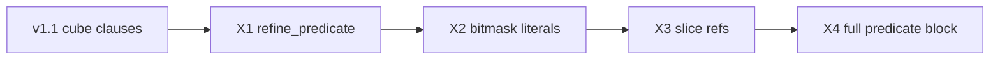

# Lemma 表達力擴充路線圖（未來計劃）

**狀態：** 待實驗 — 先用現有 protocol 跑 Phase E/Q，再依數據決定是否啟動  
**日期：** 2026-06  
**相關：** [`ARCHITECTURE.md`](../ARCHITECTURE.md)、[`experiment_plan_review.md`](experiment_plan_review.md)、[`ic3ia_predicate_mapping_audit.md`](../ic3ia_predicate_mapping_audit.md)

---

## 現況（v1.1 baseline）

LLM 能 **實際注入 frame** 的 lemma 形狀：

| 能力 | 狀態 |
|------|------|
| `block_clauses`：1～3 條獨立 OR-clause（first-wins） | ✅ 已實作 |
| 每條 clause：`stateNN`/`inputN` 對 **常數** 的 `eq`/`ne` literal | ✅ |
| `refine_predicate` AST（`bvand`、`extract`、`ult`…） | ⚠️ 可 parse，**未接入** IC3IA |
| bit-slice ref、兩變數比較、任意 BTOR2 子圖 | ❌ |

**結論：** 表達力 ≈ **MIC 式 cube generalization**；對 control-heavy 案夠用，對 bitmask/算术案可能不足。

---

## 先用現有設定跑實驗（Gate 0）

在擴充 expressiveness **之前**，用目前預設完成 Phase E/Q，收集以下訊號：

| 指標 | 來源 | 解讀 |
|------|------|------|
| `accepted` / `req_n` | CSV + `LLM_STATS` | 整體有用性 |
| `rejected_initial` vs `induction_fail` vs `vocab_fail` | 歸檔 manifest | init 太寬 vs 不 inductive vs 幻覺 ref |
| `parse_fail` / `schema_fail` | sidecar log | JSON 穩定度（非表達力問題） |
| 失敗案 CTI literal 型態 | `requests.jsonl` / digest | 是否全是 `stateNN=常數`（窄語言仍可能夠） |

### Go / No-go（是否啟動本路線圖）

| 觀察 | 建議 |
|------|------|
| 多數案 `accepted≥1`，且 `induction_fail` 為主 | **暫不擴** expressiveness；優先 prompt / digest / snapshot（Track B） |
| 大量 `accepted=0`，CTI 明顯需 bitmask/关系，且 `rejected_initial` 低 | **啟動 Phase X1**（`refine_predicate` 接入） |
| `vocab_fail` / `schema_fail` 高 | 先修通道與 prompt，**不是**加 op |
| 大案（ILA）0 accept、小案有 accept | 分 tier 決策；大案才啟動 X2+ |

**觸發條件（建議）：** Phase Q 完成後，若 **≥30% 有 LLM 活動的案** `accepted=0` 且歸檔顯示 witness 涉及非 cube literal → 排程 **X1**。

---

## 推薦擴充順序（由易到難）

原則：**每階段只加一種表達力、保持 JSON 可驗證、每階段有獨立 A/B**。



### Phase X1 — 接入 `refine_predicate`（IC3IA）【最優先】

**為什麼先做：** AST + schema + prompt **已有**；C++ `build_predicate_term` 已有；只差 `try_apply_llm_refine_predicate()` 與 IC3IA predicate 註冊。  
**新增能力：** `(bvand state mask) = 0`、`extract`、比較兩個 BV 子式等（仍限 closed whitelist）。

| Task | 內容 | 驗收 |
|------|------|------|
| X1.1 | `IC3IA::try_apply_llm_refine_predicate` 實作：predicate → `lbl2pred_` / abstraction | 單元測試 + p040 predicate-only response accept |
| X1.2 | block + predicate 同 response 語意（predicate 先於 block 或並行） | 文件 + smoke |
| X1.3 | feedback 支援 predicate witness | `induction_failed` 含 predicate 子式 |
| X1.4 | harness flag `--llm-allow-refine-predicate`（預設 on for ic3ia） | Phase E 子集 A/B |

**不做的：** quantifier、任意 SMT-LIB、Verilog ref。

---

### Phase X2 — Block literal 支援 `bvand` 常數 mask【次優先】

**為什麼：** 很多硬件 bad core 是 `(state & MASK) ≠ PATTERN`，不必完整 predicate tree。  
**形式（提案）：**

```json
{
  "ref": "state1536",
  "op": "bvand",
  "mask": "3",
  "rhs": "0",
  "polarity": false
}
```

語意：`¬((state1536 & 3) = 0)` 作為 OR-clause 中的一個 literal。

| Task | 內容 | 驗收 |
|------|------|------|
| X2.1 | 擴 `IC3FrameDisjunct` + `build_block_clause_from_disjuncts` | C++ 測試 |
| X2.2 | schema + prompt 更新；仍限 **單 ref + 常數 mask** | pytest |
| X2.3 | p040 / 1～2 個曾 `induction_fail` 的 HWMCC 小案對照 | `accepted` 提升或 fail 原因轉移 |

---

### Phase X3 — Symbol registry 暴露 bit-slice ref【視數據啟動】

**為什麼：** 寬 state 上「整向量相等」太粗，induction 易失敗。  
**形式：** registry 增加 `state1536[3:1]` 或 `state1536@hi:lo` 作為合法 `ref`（對應 `extract`）。

| Task | 內容 | 驗收 |
|------|------|------|
| X3.1 | `init_llm_symbol_registry` 為寬 BV state 生成 slice alias（可選、有 width 上限） | registry JSON 快照測試 |
| X3.2 | CTI literal 格式化可選輸出 slice（若 cube 含 extract） | digest 可讀 |
| X3.3 | block literal 仍用 eq/ne，但 ref 可為 slice | 1 案 end-to-end |

**風險：** registry 膨脹 → prompt 變大；需 `--llm-slice-max-width` 或 top-K slice。

---

### Phase X4 — 以 predicate 作為 block clause（非僅 refine）【長期】

**為什麼：** 統一「blocking = 布林公式」，不再局限 literal OR。  
**形式：** `block_clauses` 元素可為 `{ "form": "predicate", "node": { ... AST ... } }` 或沿用 `refine_predicate` 並允許多條。

| Task | 內容 | 驗收 |
|------|------|------|
| X4.1 | Response schema v2；C++ `build_block_clause_from_predicate` | 與 X1 共用 AST |
| X4.2 | `rel_ind_check` 對任意布林 formula（已有 term） | induction 測試 |
| X4.3 | Prompt 簡化：少談 disjunct，多談 predicate | A/B vs X1+X2 |

---

## 明確不建議（短期）

| 方向 | 原因 |
|------|------|
| 一次開放完整 BTOR2 DAG | JSON 不穩、`vocab_fail`↑、debug 難 |
| 平行驗證 3 條 clause | SMT solver 非 thread-safe；成本遠小於 LLM |
| Partial accept 多條都進 frame | 你已選 first-wins；多條都進 frame 增加 induction 互動複雜度 |
| 先做 quantifier / 函數符號 | IC3 frame 罕見需要；實作與 soundness 成本高 |

---

## 與現有實驗計劃的銜接

```
Phase E/Q（現 protocol）
  → 讀 LLM_STATS + 歸檔 requests
  → 若 Gate 0 觸發
       → Phase X1（1～2 週）
       → 再跑同一 LLM 子集 A/B
       → 若有提升再 X2；否則回 Track B（prompt/digest）
```

在 [`experiment_plan_review.md`](experiment_plan_review.md) Phase Q 之後新增：

- [ ] **Q3** 填寫本文件 § Gate 0 表格（每 tier 一列）
- [ ] **Q4** 決定是否排程 X1（需明確記錄觸發理由）

---

## 參考實作檔案（X1 起點）

| 檔案 | 用途 |
|------|------|
| [`engines/ic3base.cpp`](../../engines/ic3base.cpp) | `try_apply_llm_refine_predicate`（目前 stub） |
| [`engines/ic3_frame_ast.cpp`](../../engines/ic3_frame_ast.cpp) | `build_predicate_term` |
| [`engines/ic3base.cpp`](../../engines/ic3base.cpp) | `try_accept_first_block_clause` |
| [`llm_worker/jsonl_protocol.py`](../../llm_worker/jsonl_protocol.py) | predicate validate |
| [`docs/ic3ia_predicate_mapping_audit.md`](../ic3ia_predicate_mapping_audit.md) | IC3IA 映射約束 |

---

## 版本紀錄

| 日期 | 變更 |
|------|------|
| 2026-06 | 初稿：v1.1 cube + 3×first-wins 為 baseline；X1–X4 路線圖 |
